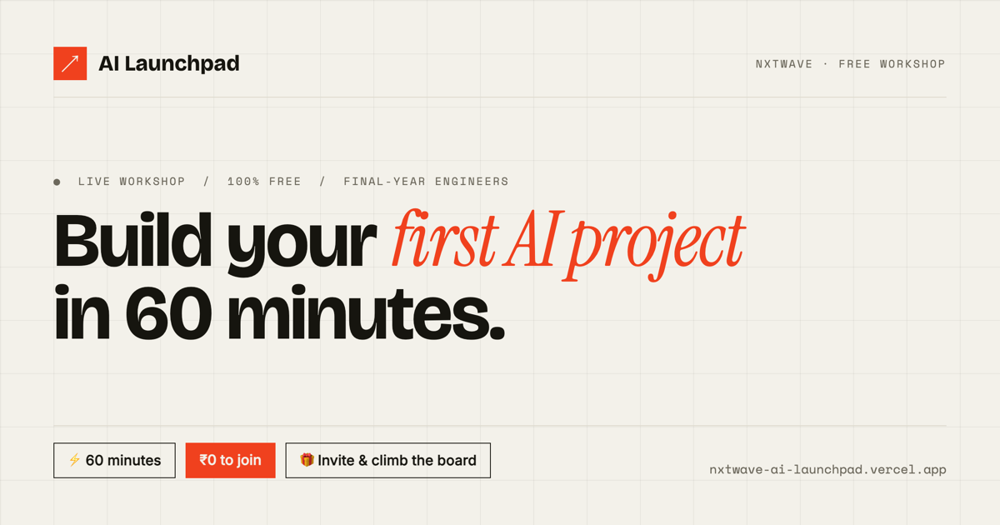

<div align="center">

# 🚀 AI Launchpad — Referral Growth Engine

**NxtWave Growth Intern Challenge · Round 1 · "Build One Thing"**

A gamified, referral-powered registration platform for the free workshop
**"Build Your First AI Project in 60 Minutes."**

Not just a landing page — a **growth loop**: register → get a personal referral code →
invite friends → climb the live leaderboard → unlock reward tiers → drive the campaign to **500**.

### [🌐 &nbsp;Live Demo &nbsp;→](https://nxtwave-ai-launchpad.vercel.app)

[Why this instead of a landing page](#why-this-is-more-than-a-landing-page) ·
[Run it](#run-it-locally) · [Deploy a live link](#deploy-a-live-link) ·
[Growth Plan](docs/GROWTH-PLAN.md) · [AI Notes](docs/AI-NOTES.md)

<br />



</div>

---

## The brief, in one line

> Get **500 final-year engineering students** to register for a free 60-minute AI workshop.
> Budget **₹2,000**, **7 days**, any AI tools. Build **one working asset**.

The challenge hints that *"everyone might build a landing page."* So this asset combines **three** of
the suggested builds into one product — a landing page **+** referral code & tracker **+** in-page
engagement tooling — because the viral referral loop is the only mechanism that turns ₹2,000 and 7
days into 500 registrations without paid ads carrying the whole load.

## Why this is more than a landing page

| Everyone's landing page | This growth engine |
| --- | --- |
| One-way: visit → maybe register | **Two-way loop**: register → *you become a channel* |
| Flat CTA | **Personal referral code** generated on sign-up (`RAKS-AI430`) |
| No reason to share | **5 reward tiers** + **live leaderboard** make sharing a game |
| No progress signal | **Live 0→500 goal bar** creates collective momentum & urgency |
| Static | **WhatsApp 1-tap share**, `?ref=` attribution, state persisted |

**The math it unlocks:** if 170 students each bring just 2 friends, that's 340 referred + 170 = **510 registrations** — the 500 target hit almost entirely through earned/organic reach, keeping the ₹2,000 for a tiny seed push to the first ~150 registrants. (See [Growth Plan](docs/GROWTH-PLAN.md).)

## ✨ Features

- **Live countdown** to the workshop
- **One-click registration** → auto-generated personal referral code
- **Referral dashboard** — your invites, live rank, current tier, next-tier progress
- **Live leaderboard** with animated podium (you appear and climb in real time)
- **Progress-to-500 goal bar** — the exact campaign target, with animated count-up
- **5 gamified reward tiers** (Starter → Legend) that unlock as you refer
- **WhatsApp / native share** with pre-written invite copy + `?ref=CODE` attribution
- **Real backend (Supabase)** — cross-user registrations, referral attribution and a live, shared
  leaderboard with realtime updates. Falls back to a self-contained demo when no keys are set.
- **Editorial / Swiss UI** — warm paper, big Bricolage Grotesque type, a serif-italic accent,
  hairline Swiss grid, one vermilion accent, scroll reveals, confetti, fully responsive.

## 🛠 Tech stack

- **React 18 + TypeScript** (Vite 6)
- **Supabase** (Postgres + Realtime) for the backend — optional, with graceful demo fallback
- **Tailwind CSS v4** (CSS-first config)
- **Framer Motion** for animation
- **canvas-confetti**, **lucide-react** icons
- Fonts: Bricolage Grotesque (display) · Instrument Serif (accent) · Inter (body) · Space Mono (numerals)

## Run it locally

```bash
npm install
npm run dev     # http://localhost:5173
```

```bash
npm run build   # type-check + production build to /dist
npm run preview # preview the production build
```

## Deploy a live link

The app is a static SPA — deploy `dist/` anywhere. Fastest options (free):

- **Vercel:** `npm i -g vercel && vercel` (framework auto-detected as Vite)
- **Netlify:** build command `npm run build`, publish directory `dist`
- **GitHub Pages:** push, then serve `dist/` via an action

## Backend — make it live with Supabase (~5 min)

The app ships **live-ready**. With no keys it runs in **demo mode** (seeded leaderboard + local
referral simulation). Add two keys and it becomes a real, shared, cross-user system — the UI is
identical in both modes (see [`src/lib/store.ts`](src/lib/store.ts) and
[`src/lib/supabase.ts`](src/lib/supabase.ts)).

1. Create a free project at [supabase.com](https://supabase.com).
2. **SQL Editor → New query** → paste [`supabase/schema.sql`](supabase/schema.sql) → **Run**.
   (Creates the `registrations` table + `leaderboard` view, RLS policies, realtime, and seed data.)
3. **Settings → API** → copy the **Project URL** and the **anon / public** key.
4. Add them as env vars — locally in a `.env` (copy [`.env.example`](.env.example)), and in
   **Vercel → Settings → Environment Variables**:
   ```
   VITE_SUPABASE_URL=https://xxxx.supabase.co
   VITE_SUPABASE_ANON_KEY=eyJhbGciOi...
   ```
5. Redeploy. Registrations now persist for everyone, `?ref=CODE` attributes referrals, and the
   leaderboard updates live across devices.

**What's real now:** registrations are rows in Postgres; your referral count is a live query;
the leaderboard is a SQL view ordered by referrals; new signups push updates over Supabase Realtime.
The **"▶ Demo"** button inserts a real referred row so reviewers can watch the board move.

## Project structure

```
src/
├─ App.tsx                 # page composition + modal state
├─ lib/
│  ├─ data.ts              # copy, tiers, agenda, FAQ, seed data
│  ├─ supabase.ts          # Supabase client (null → demo mode)
│  └─ store.ts             # useCampaign(): register / referrals / leaderboard / countdown
└─ components/
   ├─ Background.tsx       # Swiss paper grid
   ├─ Nav.tsx  Hero.tsx    # nav + editorial hero with countdown panel
   ├─ GoalBar.tsx          # 0→500 progress
   ├─ Sections.tsx         # audience / why / agenda
   ├─ Tiers.tsx            # reward tiers
   ├─ Leaderboard.tsx      # live ruled leaderboard table
   ├─ RegisterModal.tsx    # registration + confetti
   ├─ Dashboard.tsx        # referral tracker
   └─ FaqFooter.tsx        # FAQ + final CTA + footer
supabase/schema.sql        # DB schema + seed (run once)
```

## Deliverables for the challenge

- **Working asset:** this app ✅
- **Growth Plan (≤2 pages):** [`docs/GROWTH-PLAN.md`](docs/GROWTH-PLAN.md)
- **AI + Learning Notes:** [`docs/AI-NOTES.md`](docs/AI-NOTES.md)
- **3-minute video:** record a walkthrough of this app + the plan

---

<div align="center">
Built for the NxtWave Growth Intern Challenge.
</div>
